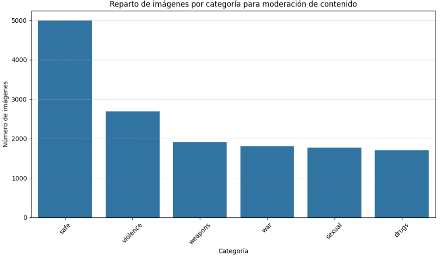

# Trabajo de Fin de Master de Ciencia de Datos

**Nombre:** Clasificación de contenido explicito en internet

**Objetivo:** Mediante la clasificación supervisada multiclase de Deep Learning, entrenar un modelo de Redes Neuronales que permita la moderación de contenido multimedia sensible o explicito. 

**Problemática actual:** Con el avance acelerado de la IA y los nuevos métodos de generación de contenido multimedia, se han aumentado los casos de Bulos, fakes, deepfakes, etc. 
Estos recursos son subidos diariamente a plataformas que podrían ser sensibles para el publico o consumidas por menores de edad. 

**Estado del arte:** 

Como panorama general, la moderación de contenido en plataformas modernas es una cadena híbrida:
- Sistemas automáticos (hashing, reglas, clasificadores ML/DL, modelos multimodales) + priorización/triage + revisión humana. 
- Las empresas emplean filtros rápidos (hashing) para material ilegal conocido, modelos de clasificación para categorías (violencia, desnudez, drogas, armas, etc.) y sistemas de ranking/escala para decidir qué revistar manualmente o eliminar automáticamente. 
- Los sistemas automáticos buscan reducir contenido dañino antes de la intervención humana.

**Clases:**
- **VIOLENCE** (violencia)
- **DRUGS** (drogas)
- **SEXUAL** (sexual)
- **WEAPONSE** (armamento)
- **WAR** (guerra)
- **SAFE** (seguro)

**Dataset**

**Scripts para dataset:**

- Script 'web_scrapping_images' para web scraping genérico 
- Script 'web_scrapping_images_pages_1_20' para web scraping masivo (webs con paginación) 
- Script 'extract_frames_and_inventory', el cual limpia, renombra, entrae frames y clasifica todas las imagenes en un CSV y al final ejecuta el siguiente script.
    Para ejecutarlo:  
    #python extract_frames_and_inventory.py --root data --csv inventory.csv --change_names True
- Script 'generate_zip_data', el cual genera un .zip del dataset (junto con el csv), para luego ser subido a un entorno publico, para ser tratado desde el notebook

## Entornos

**Notebook:** https://drive.google.com/file/d/1FioWp7SUC6i1S1K77hnopbH3KwXBrN3q/view?usp=sharing

**Producción:** https://explicit-content-classifier.streamlit.app/

## Diapositivas

https://www.canva.com/design/DAG7BVztEAo/1LGue7M-ziLO_-mYeefNBQ/edit?utm_content=DAG7BVztEAo&utm_campaign=designshare&utm_medium=link2&utm_source=sharebutton
